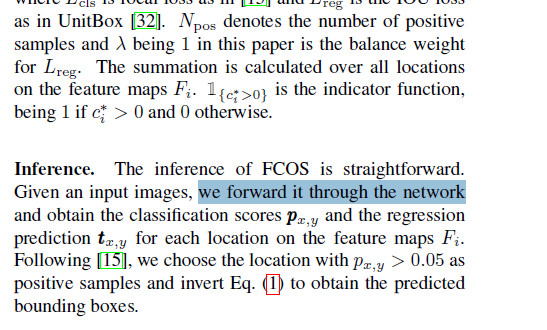
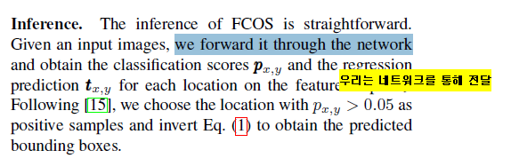

# Python_Clipboard_Translation (Google)

## # Installation
```sh
pip install pyperclip
pip install googletrans
pip install PyQt5
```

## # A quick demo
1. Run main.py
```sh
python main.py
```

2. Drag and drop (Sentence or Word)




3. Ctrl + C !!




Please note that:
1. If you want to different languages, please replace "src" and "dest".
```python
# main.py - lines 84
output = self.translator.translate(search_string, src = 'en', dest = 'ko')
```

## # Reference
- https://pypi.org/project/googletrans/
- https://pypi.org/project/pyperclip/
- https://build-system.fman.io/pyqt5-tutorial
